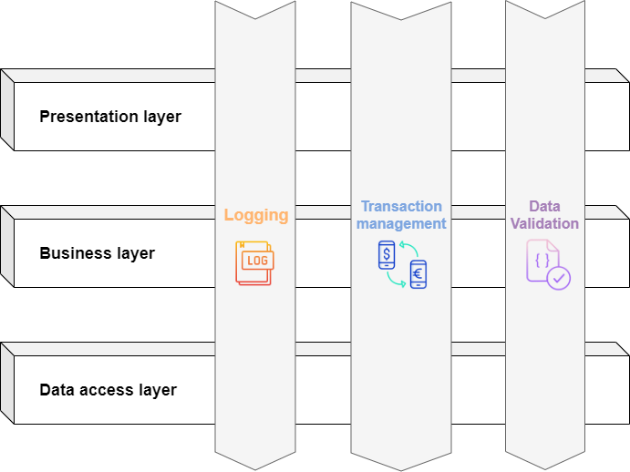
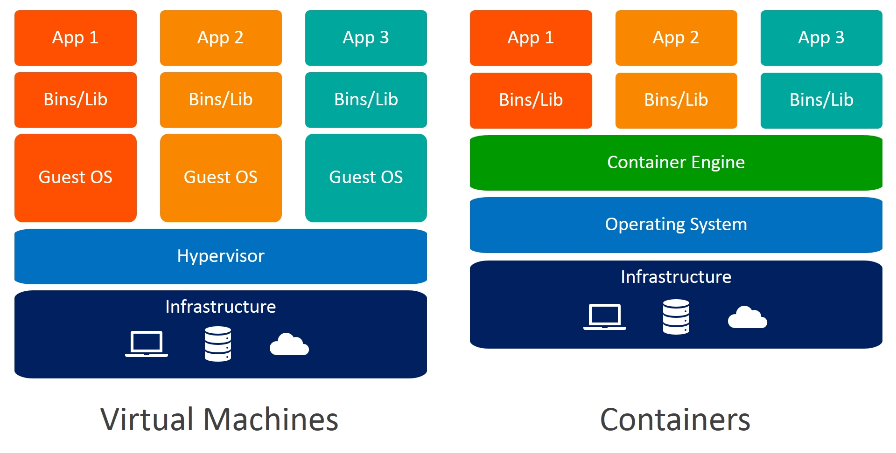

# 🚀 Ultimate Java Developer Interview Questions

# Table of Contents

## - [Java Versions and Features](sections/java-versions.md)
## - [String](sections/strings.md)
## - [OOP](sections/oop.md)

- [Java](#java) 

    - [Collections](#collections)
    - [Multithreading](#multithreading)
    - [Lambda](#lambda)
    - [Stream](#stream)
        - [What is the difference between map and flat map](#question-what-is-the-difference-between-map-and-flat-map)

- [SOLID](#solid)
- [Design Patterns](#design-patterns)
- [Spring Boot](#spring-boot)
    - [Core](#core)
      - [How HTTPS requests flow through the Spring Boot application?](https://medium.com/javarevisited/top-15-spring-boot-interview-questions-and-answers-for-java-developers-series-24-q-a-on-actuators-7253402c671)
      - [What happens in the background when a Spring Boot Application is “Run as Java Application”?](https://medium.com/javarevisited/top-15-spring-boot-interview-questions-and-answers-for-java-developers-series-24-q-a-on-actuators-7253402c671)
    - [JPA](#jpa)
    - [Caching](#caching)
    - [Transaction](#transaction)
    - [AOP](#aop)
      - [What is AOP?](#what-is-aop)
      - [Which design pattern applies to spring AOP?](#which-design-pattern-applies-to-spring-aop)
      - [What are the benefices of AOP?](#what-are-the-benefices-of-aop)
      - [AOP use cases](#aop-use-cases)
      - [Advantages and Disadvantages of AOP](#advantages-and-disadvantages-of-aop)
      - [AOP terminology](#aop-terminology)
      - [What advice types are in AOP?](#what-advice-types-are-in-aop)
      - [What type of weaving do you know?](#what-type-of-weaving-do-you-know)
      - [What are the differences of Spring AOP and AspectJ?](#what-are-the-differences-of-spring-aop-and-aspectj)
      - [AOP pointcut execution](#aop-pointcut-execution)
- [Microservices](#microservices)
    - [Patterns](#patterns)
- [Algorithms](#algorithms)
- [Database](#database)
- [Communication protocols](#communication-protocols)
- [DevOps](#devops)
    - [Docker](#docker)
        - [What is the difference between Container vs virtual machine?](#question-what-is-the-difference-between-container-vs-virtual-machine)
- [CI/CD](#cicd)
- [Git](#git)

# Java

---

## Collections

## Multithreading
### Question: What is daemon threads?

### Question: What does thread.join() method? 

### Question: What is the difference between latency and throughput

- **Latency** - The time to completion of a task. Measured in time units
- **Throughput** - The amount of tasks completed in a given period. Measured in tasks/time unit

Answer:

## Lambda

## Stream

## Stream

### Question: What is the difference between map and flat map

- `map` is used to transform each element of a collection independently and returns a new collection with the 
transformed elements.
- `flatMap` is used to transform each element of a collection into a sequence of elements and then flatten the 
  sequences into a single collection.

In other words, map applies a one-to-one transformation to each element, while flatMap applies a one-to-many 
transformation and flattens the resulting sequences into a single collection.

Example using map:

    List<String> words = Arrays.asList("Hello", "world");
    List<Integer> wordLengths = words.stream()
                                     .map(String::length)
                                     .collect(Collectors.toList());
    // Result: [5, 5]

Example using flatMap:

    List<List<Integer>> listOfLists = Arrays.asList(Arrays.asList(1, 2), Arrays.asList(3, 4));
    List<Integer> flattenedList = listOfLists.stream()
                                             .flatMap(List::stream)
                                             .collect(Collectors.toList());
    // Result: [1, 2, 3, 4]

# SOLID

---

# Design patterns

---

# Spring Boot

## Core

## JPA

## Caching

## Transaction

## AOP

### What is AOP?

Answer:
- Programming technique based on the concept of an Aspect
- Aspect encapsulates cross-cutting logic
- Cross-cutting concerns (concern - logic/functionality)

### Which design pattern applies to spring AOP?
Answer: Proxy design pattern

### What are the benefices of AOP?
Answer:

-
-
-

### AOP use cases
Answer:

### Advantages and Disadvantages of AOP
Answer:

- Advantages:
  - Reusable modules
  - Resolve code tangling
  - Resolve code scatter
  - Applied selectively based on configuration
- Disadvantages:
  - Too many aspects and app flow is hard to follow
  - Monitor performance cost for aspect execution (runtime weaving)

### AOP terminology
Answer:

- Aspect: module of code for a cross-cutting concern
- Advice: What action is taken and when is should be applied
- Join Point: When to apply code during program execution
- Point cut: A predicate expression for where advice should be applied

### What advice types are in AOP?
Answer:

- Before advice: run before the method
- After finally advice: run after the method (finally)
- After returning advice: run after the method (success execution)
- After throwing advice: run after the method (if exception thrown)
- Around advice: run before and after the method

### What type of weaving do you know?
Answer:

- Compile time 
- Load time (runtime)
- _Note: Runtime weaving is the slowest_

### What are the differences of Spring AOP and AspectJ?

### AOP pointcut execution

---

# Microservices

## Patterns

---

# Algorithms

---

# Database

## How can you find slow queries in PostgreSQL?
Answer:

- Using the slow query log: The slow query log is a file that logs all queries that take longer than a certain amount of time to execute.
- Using auto_explain extension: PostgreSQL can help to surface the slow queries, Lets explore in subsequent sections.
- Using pg_stat_statements: pg_stat_statements is a built-in PostgreSQL extension that collects statistics about SQL statements. This information can be used to identify the queries that are consuming the most CPU or I/O, and the ones that are causing the most waits.

---

# Communication protocols

---

# DevOps

---

## Docker

### Question: What is the difference between Container vs virtual machine

Answer:

| Feature                     | Container                                                                               | Virtual machine                       |
|-----------------------------|-----------------------------------------------------------------------------------------|---------------------------------------|
| Resource usage              | More efficient                                                                          | Less efficient                        |
| Start-up and shut-down time | Faster                                                                                  | Slower                                |
| Isolation                   | Shares the operating system kernel, but has its own isolated file system and resources	 | Has its own isolated operating system |
| Security                    | Less secure than VMs	                                                                   | More secure than containers           |

- Containers:
    - Share the host OS kernel, making them lightweight and efficient.
    - Minimal overhead, faster to start, and use fewer resources.
    - Provide process-level isolation; applications share the host kernel.
    - Highly portable across different environments.
    - Ideal for microservices, cloud-native apps, and quick scaling.

- Virtual Machines:
    - Run with their own OS and kernel, which can be resource-intensive.
    - Have more overhead, requiring additional memory and CPU resources.
    - Offer strong isolation due to separate OS instances.
    - Less portable, especially when migrating between hypervisors or providers.
    - Suited for legacy apps, strong isolation, and running different OS on one host.

# CI/CD

---

# GIT

---