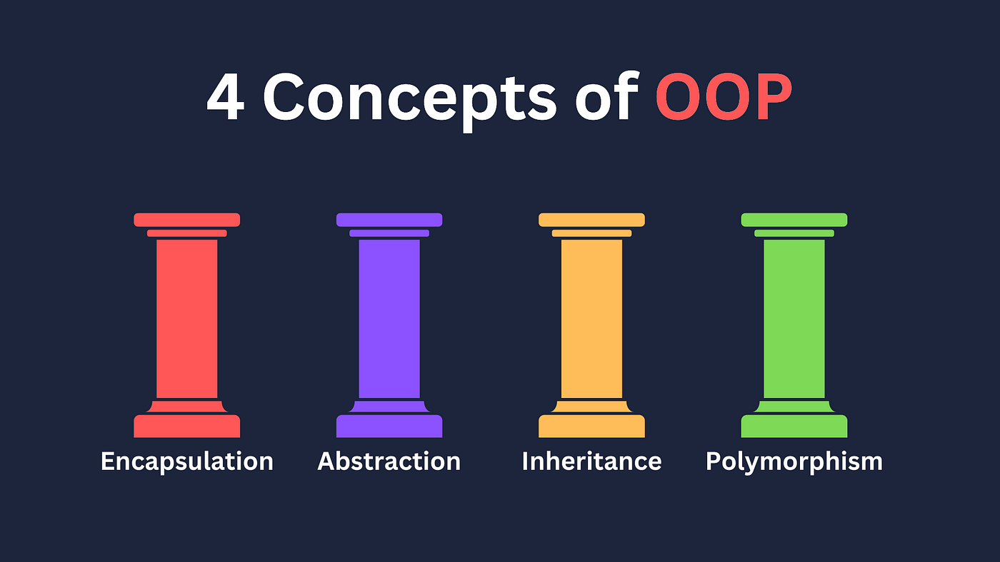

# 🚀 Ultimate Java Developer Interview Questions

# Table of Contents

- [Java](#java)
    - [String](#string)
    - [OOP](#oop)
        - [What are the 4 pillars of OOPS?](#question-what-are-the-4-pillars-of-oops)
    - [Collections](#collections)
    - [Multithreading](#multithreading)
    - [SOLID](#solid)
    - [Design Patterns](#design-patterns)
    - [Lambda](#lambda)
    - [Stream](#stream)
        - [What is the difference between map and flat map](#question-what-is-the-difference-between-map-and-flat-map)
    - [Java versions and New Features](#java-versions-and-new-features)
        - [JDK 1 Features](#jdk-1-features)
        - [J2SE 1.2 Features](#j2se-12-features)
        - [J2SE 1.3 Features](#j2se-13-features)
        - [J2SE 1.4 Features](#j2se-14-features)
        - [J2SE 5 Features](#j2se-5-features)
        - [Java SE 6 Features](#java-se-6-features)
        - [Java SE 7 Features](#java-se-7-features)
        - [Java 8 Features](#java-8-features)
        - [Java 9 Features](#java-9-features)
        - [Java 10 Features](#java-10-features)
        - [Java 11 Features (LTS)](#java-11-features-lts)
        - [Java 12 Features](#java-12-features)
        - [Java 13 Features](#java-13-features)
        - [Java 14 Features](#java-14-features)
        - [Java 15 Features](#java-15-features)
        - [Java 16 Features](#java-16-features)
        - [Java 17 Features (LTS)](#java-17-features-lts)
        - [Java 18 Features](#java-18-features)
        - [Java 19 Features](#java-19-features)
        - [Java 20 Features](#java-20-features)
        - [Java 21 Features (LTS)](#java-21-features-lts)
- [Spring Boot](#spring-boot)
    - [Core](#core)
      - [How HTTPS requests flow through the Spring Boot application?](#https://medium.com/javarevisited/top-15-spring-boot-interview-questions-and-answers-for-java-developers-series-24-q-a-on-actuators-7253402c671)
      - [What happens in the background when a Spring Boot Application is “Run as Java Application”?](#https://medium.com/javarevisited/top-15-spring-boot-interview-questions-and-answers-for-java-developers-series-24-q-a-on-actuators-7253402c671)
    - [JPA](#jpa)
    - [Caching](#caching)
    - [Transaction](#transaction)
    - [AOP](#aop)
- [Microservices](#microservices)
    - [Patterns](#patterns)
- [Algorithms](#algorithms)
- [Database](#database)
- [Communication protocols](#communication-protocols)
- [DevOps](#devops)
    - [Docker](#docker)
        - [What is the difference between Container vs virtual machine](#question-what-is-the-difference-between-container-vs-virtual-machine)
- [CI/CD](#cicd)
- [Git](#git)

# Java

---

## String

## OOP

### Question: What are the 4 pillars of OOPS?

Answer:

There are 4 pillars of OOPS are:

1. Abstraction
2. Encapsulation
3. Inheritance
4. Polymorphism

Let’s take a look at them:

1. Abstraction is a way of hiding the implementation details of something and showing only the functionality that the
   user needs to know.
   This makes your code more organized and easy to understand because you can work with high-level ideas rather than
   getting lost in the complexities of every detail.

Real world examples:

- Car engine: When you drive a car, you don't need to know how the engine works or how the brakes work. You just need to
  know how to steer the car and how to use the pedals. The car abstracts away all of the complex internal details so
  that you can focus on driving.

- Computer: When you use a computer, you don't need to know how the hardware works or how the operating system works.
  You just need to know how to use the mouse and keyboard and how to open programs and files. The computer abstracts
  away all of the complex internal details so that you can focus on using the computer to do your work.

In java, Abstraction can be achieved in two ways:

- Abstract classes
- Interfaces

## Stream

### Question: What is the difference between map and flat map

## Java versions and New Features

### JDK 1 Features

Release Date : January 23, 1996

- AWT event model
- Inner classes
- JavaBeans
- JDBC
- RMI
- Reflection supported Introspection only, no modification at runtime was possible.
- JIT (Just In Time) compiler for Windows

### J2SE 1.2 Features

J2SE 1.2 Features

- strictfp keyword
- Swing graphical API
- Sun’s JVM was equipped with a JIT compiler for the first time
- Java plug-in
- Collections framework

### J2SE 1.3 Features

Release Date : May 8, 2000

- HotSpot JVM
- Java Naming and Directory Interface (JNDI)
- Java Platform Debugger Architecture (JPDA) Microservices
- JavaSound
- Synthetic proxy classes

### J2SE 1.4 Features

Release Date : February 6, 2002

- assert keyword
- Regular expressions
- Exception chaining
- Internet Protocol version 6 (IPv6) support# Algorithms
- New I/O; NIO
- Logging API
- Image I/O API
- Integrated XML parser and XSLT processor (JAXP)# Database
- Integrated security and cryptography extensions (JCE, JSSE, JAAS)
- Java Web Start
- Preferences API (java.util.prefs)

### J2SE 5 Features

Release Date : September 30, 2004

- Generics
- Annotations
- Autoboxing/unboxing
- Enumerations
- Varargs
- Enhanced for each loop
- Static imports
- New concurrency utilities in java.util.concurrent
- Scanner class for parsing data from various input streams and buffers.

### Java SE 6 Features

Release Date : December 11, 2006

- Scripting Language Support
- Performance improvements
- JAX-WS
- JDBC 4.0
- Java Compiler API
- JAXB 2.0 and StAX parser
- Pluggable annotations
- New GC algorithms

### Java SE 7 Features

Release Date : July 28, 2011

- JVM support for dynamic languages
- Compressed 64-bit pointers
- Strings in switch
- Automatic resource management in try-statement
- The diamond operator
- Simplified varargs method declaration
- Binary integer literals
- Underscores in numeric literals
- Improved exception handling
- ForkJoin Framework
- NIO 2.0 has support for multiple file systems, file metadata and symbolic links
- WatchService
- Timsort is used to sort collections and arrays of objects instead of merge sort
- APIs for the graphics features
- Support for new network protocols, including SCTP and Sockets Direct Protocol

### Java 8 Features

Release Date : March 18, 2014

- Lambda expression support in APIs
- Stream API
- Functional interface and default methods
- Optionals
- Nashorn – JavaScript runtime which allows developers to embed JavaScript code within applications
- Annotation on Java Types
- Unsigned Integer Arithmetic
- Repeating annotations
- New Date and Time API
- Statically-linked JNI libraries
- Launch JavaFX applications from jar files
- Remove the permanent generation from GC

### Java 9 Features

Release Date : September, 2017

- Java platform module system
- Interface Private Methods
- HTTP 2 Client
- JShell – REPL Tool
- Platform and JVM Logging
- Process API Updates
- Collection API Updates
- Improvements in Stream API
- Multi-Release JAR Files
- @Deprecated Tag Changes
- Stack Walking
- Java Docs Updates
- Miscellaneous Other Features

### Java 10 Features

- JEP 286: Local Variable Type Inference
- JEP 322: Time-Based Release Versioning
- JEP 304: Garbage-Collector Interface
- JEP 307: Parallel Full GC for G1
- JEP 316: Heap Allocation on Alternative Memory Devices
- JEP 296: Consolidate the JDK Forest into a Single Repository
- JEP 310: Application Class-Data Sharing
- JEP 314: Additional Unicode Language-Tag Extensions
- JEP 319: Root Certificates
- JEP 317: Experimental Java-Based JIT Compiler
- JEP 312: Thread-Local Handshakes
- JEP 313: Remove the Native-Header Generation Tool
- New Added APIs and Options
- Removed APIs and Options

### Java 11 Features (LTS)

- HTTP Client API
- Launch Single-File Programs Without Compilation
- String API Changes
- Collection.toArray(IntFunction)
- Files.readString() and Files.writeString()
- Optional.isEmpty()

### Java 12 Features

- Collectors.teeing() in Stream API
- String API Changes
- Files.mismatch(Path, Path)
- Compact Number Formatting
- Support for Unicode 11
- Switch Expressions (Preview)

### Java 13 Features

- JEP 355 – Text Blocks (Preview)
- JEP 354 – Switch Expressions Enhancements (Preview)
- JEP 353 – Reimplement the Legacy Socket API
- JEP 350 – Dynamic CDS Archive
- JEP 351 – ZGC: Uncommit Unused Memory
- FileSystems.newFileSystem() Method
- DOM and SAX Factories with Namespace Support

### Java 14 Features

- JEP 305 – Pattern Matching for instanceof (Preview)
- JEP 368 – Text Blocks (Second Preview)
- JEP 358 – Helpful NullPointerExceptions
- JEP 359 – Records (Preview)
- JEP 361 – Switch Expressions (Standard)
- JEP 343 – Packaging Tool (Incubator)
- JEP 345 – NUMA-Aware Memory Allocation for G1
- JEP 349 – JFR Event Streaming
- JEP 352 – Non-Volatile Mapped Byte Buffers
- JEP 363 – Remove the Concurrent Mark Sweep (CMS) Garbage Collector
- JEP 367 – Remove the Pack200 Tools and API
- JEP 370 – Foreign-Memory Access API (Incubator)

### Java 15 Features

- Sealed Classes and Interfaces (Preview) (JEP 360)
- EdDSA Algorithm (JEP 339)
- Hidden Classes (JEP 371)
- Pattern Matching for instanceof (Second Preview) (JEP 375)
- Removed Nashorn JavaScript Engine (JEP 372)
- Reimplement the Legacy DatagramSocket API (JEP 373)
- Records (Second Preview) (JEP 384)
- Text Blocks become a standard feature. (JEP 378)

### Java 16 Features

- JEP 338: Vector API (Incubator)
- JEP 347: Enable C++14 Language Features
- JEP 357: Migrate from Mercurial to Git
- JEP 369: Migrate to GitHub
- JEP 376: ZGC: Concurrent Thread-Stack Processing
- JEP 380: Unix-Domain Socket Channels
- JEP 386: Alpine Linux Port
- JEP 387: Elastic Metaspace
- JEP 388: Windows/AArch64 Port
- JEP 389: Foreign Linker API (Incubator)
- JEP 390: Warnings for Value-Based Classes
- JEP 392: Packaging Tool
- JEP 393: Foreign-Memory Access API (Third Incubator)
- JEP 394: Pattern Matching for instanceof
- JEP 395: Records
- JEP 396: Strongly Encapsulate JDK Internals by Default
- JEP 397: Sealed Classes (Second Preview)

### Java 17 Features (LTS)

- (JEP-306) Restore Always-Strict Floating-Point Semantics
- (JEP-356) Enhanced Pseudo-Random Number Generators
- (JEP-382) New macOS Rendering Pipeline
- (JEP-391) macOS/AArch64 Port
- (JEP-398) Deprecate the Applet API for Removal
- (JEP-403) Strongly Encapsulate JDK Internals
- (JEP-406) Pattern Matching for switch (Preview)
- (JEP-407) Remove RMI Activation
- (JEP-409) Sealed Classes
- (JEP-410) Remove the Experimental AOT and JIT Compiler
- (JEP-411) Deprecate the Security Manager for Removal
- (JEP-412) Foreign Function & Memory API (Incubator)
- (JEP-414) Vector API (Second Incubator)
- (JEP-415) Context-Specific Deserialization Filters

### Java 18 Features

- JEP-400: UTF-8 by Default
- JEP-408: Simple Web Server
- JEP-413: Code Snippets in Java API Documentation
- JEP-416: Reimplement Core Reflection with Method Handles
- JEP-417: Vector API (Third Incubator)
- JEP-418: Internet-Address Resolution SPI
- JEP-419: Foreign Function & Memory API (Second Incubator)
- JEP-420: Pattern Matching for switch (Second Preview)
- JEP-421: Deprecate Finalization for Removal

### Java 19 Features

- Pattern Matching for Switch
- Record Patterns
- Foreign Function & Memory API
- Virtual Threads
- Structured Concurrency
- Vector API
- Locale Class Constructors Deprecated
- ThreadGroup Degraded

### Java 20 Features

- (JEP 429) Scoped Values
- (JEP 432) Record Patterns
- (JEP 433) Pattern Matching for Switch
- (JEP 434) Foreign Function and Memory API
- (JEP 436) Structured Concurrency
- (JEP 437) Structured Concurrency
- (JEP 438) Vector API

### Java 21 Features [LTS]

- String Templates (Preview) [JEP-430]
- Sequenced Collections [JEP-431]
- Generational ZGC [JEP-439]
- Record Patterns [JEP-440]
- Pattern Matching for switch [JEP-441]
- Foreign Function & Memory API (Third Preview) [JEP-442]
- Unnamed Patterns and Variables (Preview) [JEP-443]
- Virtual Threads [JEP-444]
- Unnamed Classes and Instance Main Methods (Preview) [JEP-445]
- Scoped Values (Preview) [JEP-446]
- Vector API (Sixth Incubator) [JEP-448]
- Deprecate the Windows 32-bit x86 Port for Removal [JEP-449]
- Prepare to Disallow the Dynamic Loading of Agents [JEP-451]
- Key Encapsulation Mechanism API [JEP-452]
- Structured Concurrency (Preview) [JEP-453]

---

# Spring Boot

## AOP

### What is AOP?

Answer:
- Programming technique based on concept of an Aspect
- Aspect encapsulates cross-cutting logic
- Cross-cutting concerns (concern - logic/functionality)

### Which design pattern apply spring AOP?
Answer: Proxy design pattern

### What are the benefices of AOP?
Answer:

-
-
-

### AOP use cases
Answer:

### Advantages and Disadvantages of AOP
Answer:

- Advantages:
  - Reusable modules
  - Resolve code tangling
  - Resolve code scatter
  - Applied selectively based on configuration
- Disadvantages:
  - Too many aspects and app flow is hard to follow
  - Monitor performance cost for aspect execution (runtime weaving)

### AOP terminology
Answer:

- Aspect: module of code for a cross-cutting concern
- Advice: What action is taken and when is should be applied
- Join Point: When to apply code during program execution
- Point cut: A predicate expression for where advice should be applied

### What advice types are in AOP?
Answer:

- Before advice: run before the method
- After finally advice: run after the method (finally)
- After returning advice: run after the method (success execution)
- After throwing advice: run after the method (if exception thrown)
- Around advice: run before and after the method

### What type of weaving do you know?
Answer:

- Compile time 
- Load time (runtime)
- _Note: Runtime weaving is the slowest_

### What are the differences of Spring AOP and AspectJ

### AOP pointcut execution

---

# Algorithms

---

# Database

## How can you find slow queries in PostgreSQL?
Answer:

- Using the slow query log: The slow query log is a file that logs all queries that take longer than a certain amount of time to execute.
- Using auto_explain extension: PostgreSQL can help to surface the slow queries, Lets explore in subsequent sections.
- Using pg_stat_statements: pg_stat_statements is a built-in PostgreSQL extension that collects statistics about SQL statements. This information can be used to identify the queries that are consuming the most CPU or I/O, and the ones that are causing the most waits.

---

# Communication protocols

---

# DevOps

---

## Docker

### Question: What is the difference between Container vs virtual machine

Answer:

| Feature                     | Container                                                                               | Virtual machine                       |
|-----------------------------|-----------------------------------------------------------------------------------------|---------------------------------------|
| Resource usage              | More efficient                                                                          | Less efficient                        |
| Start-up and shut-down time | Faster                                                                                  | Slower                                |
| Isolation                   | Shares the operating system kernel, but has its own isolated file system and resources	 | Has its own isolated operating system |
| Security                    | Less secure than VMs	                                                                   | More secure than containers           |

- Containers:
    - Share the host OS kernel, making them lightweight and efficient.
    - Minimal overhead, faster to start, and use fewer resources.
    - Provide process-level isolation; applications share the host kernel.
    - Highly portable across different environments.
    - Ideal for microservices, cloud-native apps, and quick scaling.

- Virtual Machines:
    - Run with their own OS and kernel, which can be resource-intensive.
    - Have more overhead, requiring additional memory and CPU resources.
    - Offer strong isolation due to separate OS instances.
    - Less portable, especially when migrating between hypervisors or providers.
    - Suited for legacy apps, strong isolation, and running different OS on one host.

# CI/CD

---

# GIT

---