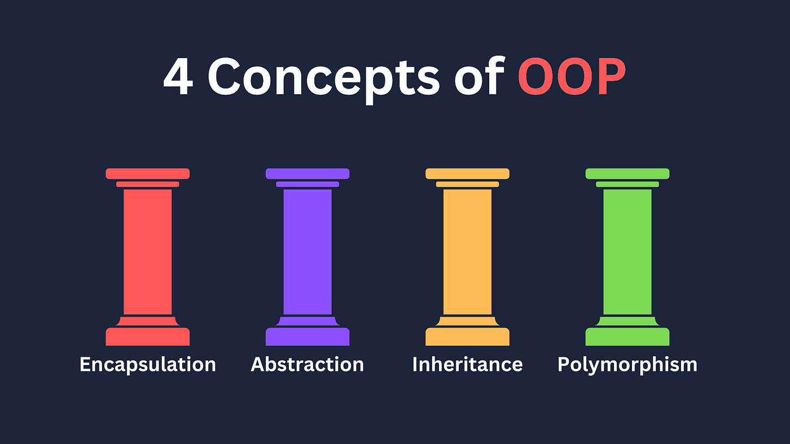

# Java OOP interview questions

**1. What are the 4 pillars of OOPS?**

There are four pillars of OOPS:

1. Abstraction
2. Encapsulation
3. Inheritance
4. Polymorphism

Let’s take a look at them:

1. Abstraction is a way of hiding the implementation details of something and showing only the functionality that the
   user needs to know.
   This makes your code more organized and easy to understand because you can work with high-level ideas rather than
   getting lost in the complexities of every detail.

   Real world examples:

    - Car engine: When you drive a car, you don't need to know how the engine works or how the brakes work. You just need to
      know how to steer the car and how to use the pedals. The car abstracts away all the complex internal details so
      that you can focus on driving.

    - Computer: When you use a computer, you don't need to know how the hardware works or how the operating system works.
      You just need to know how to use the mouse and keyboard and how to open programs and files. The computer abstracts
      away all the complex internal details so that you can focus on using the computer to do your work.

   In java, Abstraction can be achieved in two ways:

    - Abstract classes
    - Interfaces

2. Encapsulation may be used by creating ‘get’ and ‘set’ methods in a class which are used to access the fields of the
   object.
   Typically, the fields are made private while the get and set methods are public.

   To achieve encapsulation in Java:
    - Declare the variables of a class as private.
    - Provide public setter and getter methods to modify and view the variables values.

   Benefits of Encapsulation
    - The fields of a class can be made read-only or write-only.
    - A class can have total control over what is stored in its fields.

3. Inheritance.
   Using inheritance means defining a parent-child relationship between classes, by doing so, you can
   reuse the code already defined in the parent class.
   Code re-usability is the biggest advantage of Inheritance.

   _Java does not allow multiple inheritance through classes, but it allows it through interfaces._

4. Polymorphism
   Poly means many and Morph means forms. Polymorphism is the process in which an object or function takes different forms.

   There are 2 types of Polymorphism :

   ✅ Compile Time Polymorphism (Method Overloading)

   ✅ Run Time Polymorphism (Method Overriding)

In Method overloading, two or more methods in one class have the same method name but different arguments. It is called
as Compile time polymorphism because it is decided at compile time which overloaded method will be called.

Overriding means when we have two methods with same name and same parameters in parent and child class. Through overriding,
child class can provide specific implementation for the method which is already defined in the parent class.
